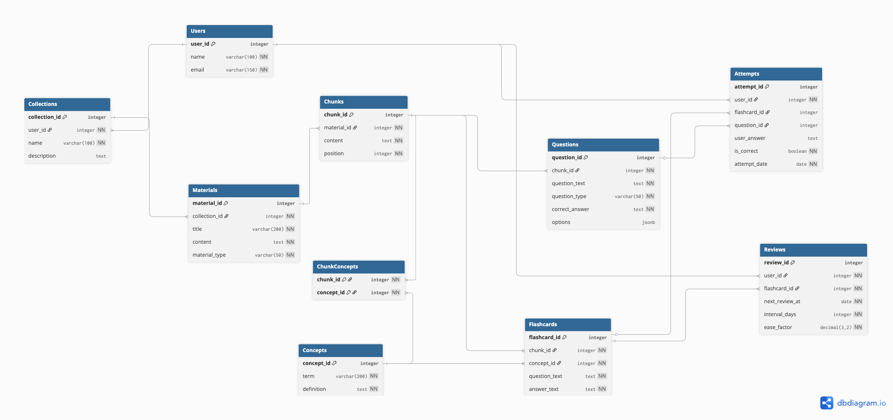

# 0. Описание предметной области

В рамках данного проекта рассматривается образовательная платформа "Омут памяти" для эффективного изучения и закрепления учебного материала. Система обеспечивает превращение конспектов и учебных материалов в структурированную систему знаний с автоматической генерацией учебных карточек и интервальным повторением.

Основные участники бизнес-процесса - пользователи (далее - студенты), которые регистрируются в системе, загружают учебные материалы (конспекты, лекции), получают автоматически сгенерированные флешкарты и тесты, проходят тренировки и отслеживают свой прогресс.

Для корректного функционирования системы необходимо фиксировать информацию о пользователях, материалах, фрагментах (нитях), концептах, учебных карточках, попытках обучения и расписании повторений.

## 1. Сущности предметной области

1. **Пользователь**

2. **Коллекция**

3. **Материал**

4. **Нить** (фрагмент материала)

5. **Концепт** (термин/определение)

6. **Флешкарта** – учебная карточка в формате "вопрос → ответ"

7. **Тестовый вопрос**

8. **Попытка** (ответ на флешкарту или вопрос)

9. **Расписание повторений**

10. **Связь нить-концепт** - реализация связи "многие-ко-многим" между "Нить" и "Концепт"

## 2.Нормализация

---

### 1НФ

Вся информация хранится в одной таблице.

**Проблемы:**
- Данные пользователя повторяются в каждой строке с попыткой
- Данные материала и нитей дублируются для каждой карточки
- Невозможно добавить коллекцию или материал без создания попытки
- При изменении названия коллекции нужно обновлять все строки
- Избыточность данных: email пользователя повторяется много раз
- Аномалии удаления: удаление всех попыток приводит к потере информации о материалах

---

### 2НФ

Устранили частичные зависимости, разделив на логические сущности:

**Группа 1: Пользователи и их контент**
- `Users` (user_id, name, email)
- `Collections` (collection_id, user_id, name, description)
- `Materials` (material_id, collection_id, title, content, material_type)

**Группа 2: Обработанные данные**
- `Chunks` (chunk_id, material_id, content, position)
- `Concepts` (concept_id, term, definition)
- `ChunkConcepts` (chunk_id, concept_id) - связь м-м

**Группа 3: Учебные артефакты**
- `Flashcards` (flashcard_id, chunk_id, concept_id, question_text, answer_text)
- `Questions` (question_id, chunk_id, question_text, question_type, correct_answer, options)

**Группа 4: Обучение**
- `Attempts` (attempt_id, user_id, flashcard_id, question_id, user_answer, is_correct, attempt_date)
- `Reviews` (review_id, user_id, flashcard_id, next_review_at, interval_days)

**Проблемы, которые остались:**
- В `Flashcards` есть зависимость `concept_id`, термин и определение (хранится в отдельной таблице `Concepts`)
- В `Attempts` одно из полей `flashcard_id` или `question_id` всегда будет NULL
- Варианты ответов в `Questions` могут быть структурированными данными (требуется JSONB)

---

### 3НФ 

Устранили транзитивные зависимости и оптимизировали структуру. Финальная структура:

1. **Users** (user_id, name, email)
2. **Collections** (collection_id, user_id, name, description)
3. **Materials** (material_id, collection_id, title, content, material_type)
4. **Chunks** (chunk_id, material_id, content, position)
5. **Concepts** (concept_id, term, definition)
6. **ChunkConcepts** (chunk_id, concept_id) - связь многие-ко-многим между нитями и концептами
7. **Flashcards** (flashcard_id, chunk_id, concept_id, question_text, answer_text)
8. **Questions** (question_id, chunk_id, question_text, question_type, correct_answer, options)
9. **Attempts** (attempt_id, user_id, flashcard_id, question_id, user_answer, is_correct, attempt_date)
10. **Reviews** (review_id, user_id, flashcard_id, next_review_at, interval_days, ease_factor)

## 3. Физическая модель

Результаты - в файлах .sql

## 4. ERD диаграмма

